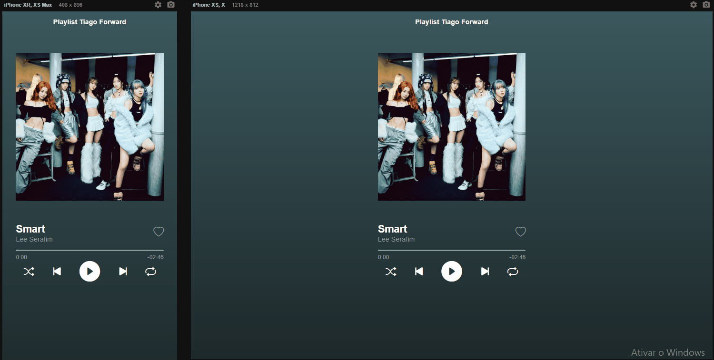

# Hashtag Programação | Player do Spotify Básico

## Tabela do Conteudo

<ul>
<li><a href="#sobre">Sobre</a></li>
<li><a href="#objetivo">Objetivo</a></li>
<li><a href="#status">Status</a></li>
<li><a href="#curiosidade">Curiosidade</a></li>
<li><a href="#tecnologias">Tecnologias</a></li>
<li><a href="#acessando-o-site">Acessando o site</a></li>
</ul>

## Sobre

Esse projeto está sendo criado através de um mini-curso básico de JavaScript da Hashtag Programação.

Aprendi muita coisa importante, foram elas algumas propriedades do JavaScript, como setProperty, clientWidth, offsetX e todas as outras propriedades que manipulam a tag de audio do html como o som na qual me chamou bastante atenção, a barra de progresso e o temporizador.
Durante esse desenvolvimento aprendi algumas funções o conversor de segundos para minutos e a função de sortear os elementos de um array.
Aprendi a utilizar o LocalStorage para armazenar dados de configuração da minha aplicação em meu navegador, simulando um backend.

## Objetivo

Ao iniciar essas aulas, meu objetivo é aprender mais sobre a tag de áudio, e como fazer um player de música, com contagem numérica, barra de progresso e o volume.

## Status

Desafio em andamento. 🥰

### Layout

## Curiosidade

Uma das funcionalidades novas que adicionei, na qual não foi apresentada no curso, foi a contagem numérica do tempo da música se reduzindo. Também não foi apresentado como modificar o volume da música, e isso ficará como um desafio futuro para mim.

## Tecnologias

<ul>
<li>HTML</li>
<li>CSS</li>
<li>JavaScript</li>
<li>GIT</li>
</ul>

## Acessando o site

Para acessar a página, por favor use esse link : <a href="https://tiago-forward.github.io/player-do-spotify-basico/" target="_blank">Player do Spotify Básico</a>